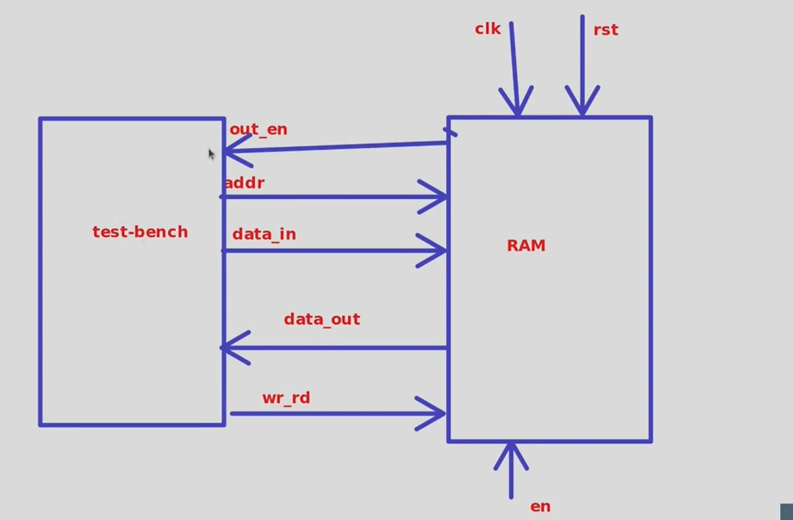

# Design-and-verification-of-signle-port-RAM

This project demonstrates the implementation and simulation of a **Single-Port Random Access Memory (RAM)** using **Verilog HDL**, complete with a **testbench** that performs write and read operations to validate memory functionality.

---

## 📌 What is RAM?

**RAM (Random Access Memory)** is a type of digital memory used to store data temporarily during computation. It allows both **read** and **write** access and is widely used in:

- CPU caches
- FPGA internal memory
- Embedded systems
- Data buffers

In digital design, RAM modules are critical for holding intermediate values, instructions, sensor data, or image buffers.

### 🧩 Types of RAM

- **Single-Port RAM**: One address/data bus shared for read and write (used here).
- **Dual-Port RAM**: Two independent ports (can read/write simultaneously).
- **Multi-Port RAM**: More than two ports, mostly used in multicore architectures.

---

## 🛠️ Project Overview

This project includes:

- ✅ Verilog design of 64x8-bit **Single-Port RAM**
- ✅ Parameterized with macros (`addr_width`, `data_width`, `data_depth`)
- ✅ Fully functional testbench:
  - Performs write
  - Triggers read
  - Verifies result

---

## 🖼️ Architecture Diagram

The block diagram below shows how the **Testbench** interacts with the **RAM module**.

**Signals:**
- `clk`: Clock signal
- `rst`: Reset signal (active low)
- `en`: Enables RAM operation
- `wr_rd`: Selects write (`1`) or read (`0`)
- `addr`: Memory address to access
- `data_in`: Input data for writing
- `data_out`: Output data when reading
- `en_out`: Output enable (used to indicate read data is valid)

---

